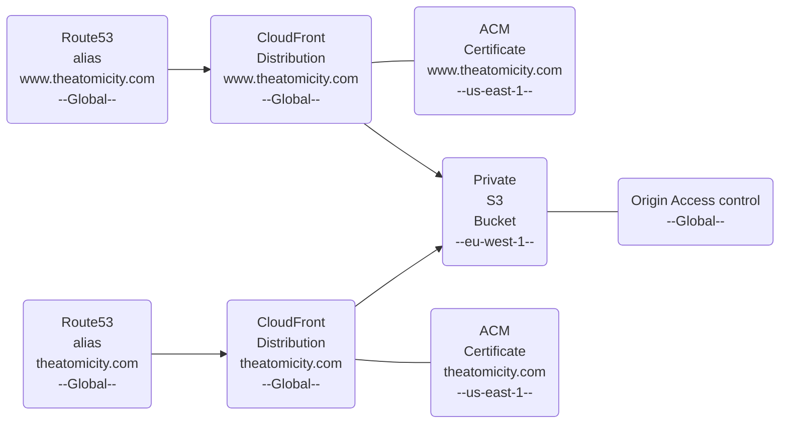

# theatomicity.com

## Preréquisite

- Public Hosted zone with registered domain
- 2 Tls Certificates in ACM
- GitHub actions role
```
make prerequisites
```

## Architecture


```mermaid
    graph LR
        Route53(Route53\nalias\ntheatomicity.com\n--Global--) --> CloudFront(CloudFront\nDistribution\ntheatomicity.com\n--Global--)
        Route53Www(Route53\nalias\nwww.theatomicity.com\n--Global--) --> CloudFrontWww(CloudFront\nDistribution\nwww.theatomicity.com\n--Global--) --> S3
        CloudFrontWww---ACMWww(ACM\nCertificate\nwww.theatomicity.com\n--us-east-1--)
        CloudFront---ACM(ACM\nCertificate\ntheatomicity.com\n--us-east-1--)
        CloudFront --> S3(Private\nS3\nBucket\n--eu-west-1--)
        S3 --- OAC(Origin Access control\n--Global--)
        
```

