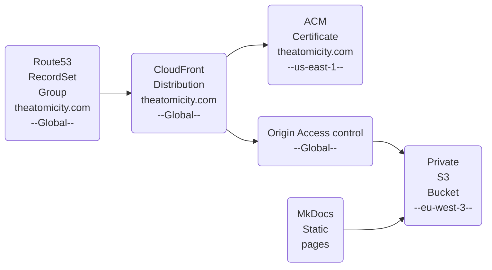

# theatomicity.com

## AWS

### Prerequisites

The following resources must exist before deploying the CDK stack.

#### 1. Public Hosted Zone (Route53)

Register or transfer the domain and create a public hosted zone in Route53. Note the **Hosted Zone ID** — it is passed as `HostedZoneID` CDK context.

#### 2. TLS Certificate (ACM — us-east-1)

CloudFront requires the certificate to be in `us-east-1`, regardless of the bucket region.

Create a certificate with:
- Domain: `theatomicity.com`
- Alternate domain: `www.theatomicity.com`

Note the **certificate UUID** (last segment of the ARN) — it is passed as `TlsCertificateUuid` CDK context.

#### 3. CDK Bootstrap

CI/CD deployments are centralized in a dedicated **management account**. Bootstrap both the management account (where the pipeline runs) and the target account (where resources are deployed), with a trust relationship so the management account can assume CDK roles in the target:

```bash
# Bootstrap the target (prod) account, trusting the management account
cdk bootstrap aws://<PROD_ACCOUNT_ID>/eu-west-3 \
  --trust <MANAGEMENT_ACCOUNT_ID> \
  --cloudformation-execution-policies arn:aws:iam::aws:policy/AdministratorAccess

# Bootstrap the management account
cdk bootstrap aws://<MANAGEMENT_ACCOUNT_ID>/eu-west-3
```

#### 4. GitHub Actions IAM Role (OIDC)

Deploys an OIDC provider and an IAM role (`the-atomicity-com-github-actions-role`) that GitHub Actions assumes via `sts:AssumeRoleWithWebIdentity`. The role is scoped to repositories under the `erwanjouan` GitHub organisation.

```bash
make prerequisites
```

#### 5. GitHub Secrets

Set the following secrets in the repository (under the `production` environment):

| Secret | Description |
|---|---|
| `AWS_PROD_ACCOUNT_ID` | AWS account ID |
| `AWS_HOSTED_ZONE_ID` | Route53 hosted zone ID from step 1 |
| `TLS_CERTIFICATE_UUID` | Certificate UUID from step 2 |

### Architecture



